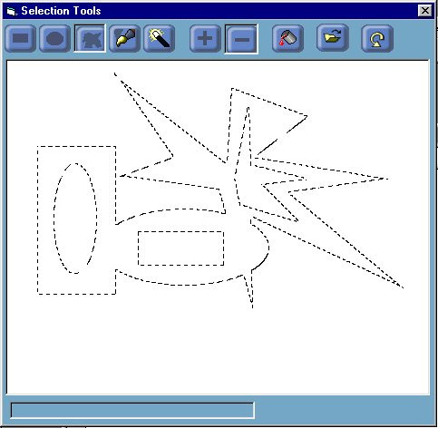

<div align="center">

## Advanced Mask Selections \- ver 1\.1


</div>

### Description

How to create complex masks, that can be built in steps, with undo/ redo functionality at each step. Masks can be built in either additive or subtractive mode, as in advanced graphics packages. Tools include :

rectangular selection, elliptical selection, polygon selection, paint

brush mask selector, magic wand selection.

Also shows how to use CreatePatternBrush() api to implement a marching

ants style border around selection ...
 
### More Info
 
Shows how to use many of the region api's including :

- CombineRgn()

- GetRegionData()

- CreateRectRgn()

- CreateEllipticRgn()

- CreatePolygonRgn()

- FillRgn()

- ExtCreateRegion()

- FrameRgn()

Also shows how to use the brush apis to create two custom brushes for

a marching ants effect.

- CreateBrushIndirect()

- CreatePatternBrush()

Don't forget to vote if you like it and any feedback, fixes, improvements, suggestions etc are most welcome ...


<span>             |<span>
---                |---
**Submitted On**   |2001-10-04 00:08:36
**By**             |[Meltdown Charlie](https://github.com/Planet-Source-Code/PSCIndex/blob/master/ByAuthor/meltdown-charlie.md)
**Level**          |Intermediate
**User Rating**    |5.0 (35 globes from 7 users)
**Compatibility**  |VB 4\.0 \(32\-bit\), VB 5\.0, VB 6\.0
**Category**       |[Graphics](https://github.com/Planet-Source-Code/PSCIndex/blob/master/ByCategory/graphics__1-46.md)
**World**          |[Visual Basic](https://github.com/Planet-Source-Code/PSCIndex/blob/master/ByWorld/visual-basic.md)
**Archive File**   |[Advanced M275181042001\.zip](https://github.com/Planet-Source-Code/meltdown-charlie-advanced-mask-selections-ver-1-1__1-27788/archive/master.zip)

### API Declarations

```
Shows how to use many of the region api's including :
			- CombineRgn()
			- GetRegionData()
			- CreateRectRgn()
			- CreateEllipticRgn()
			- CreatePolygonRgn()
			- FillRgn()
			- ExtCreateRegion()
			- FrameRgn()
		Also shows how to use the brush apis to create two custom brushes for
		a marching ants effect.
			- CreateBrushIndirect()
			- CreatePatternBrush()
```


